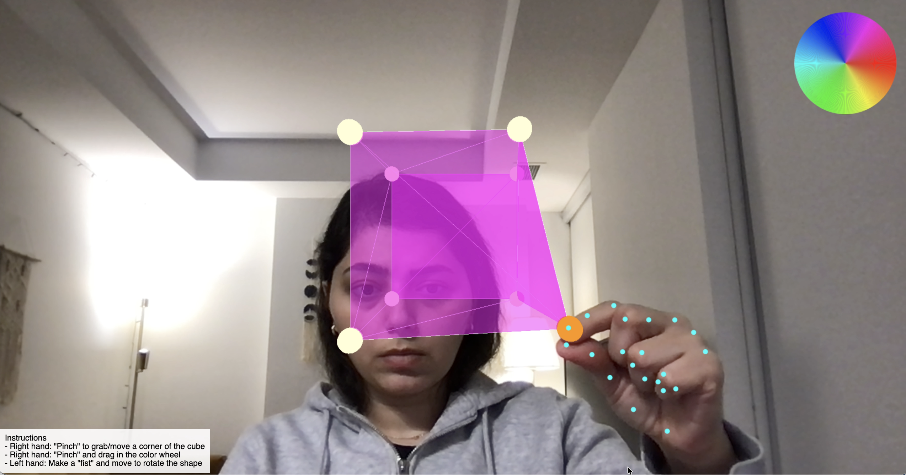

### 3D Hand Gesture Shape Editor



A ```threejs``` / ```WebGL``` / ```MediaPipe```-powered interactive web-application that allows user to edit 3D shapes with natural hand gestures.


### Gestures
* Right hand: "Pinch" to grab/move a corner of the cube.
* Right hand: "Pinch" and drag in the color wheel.
* Left hand: Make a "fist" and move to rotate the shape.


### Setup for Development

Navigate to the project sub-folder in terminal:
```bash
cd 3d_hand_gesture_shape_editor
```

In the terminal, type below command:
```bash
python3 -m http.server
```
Use your browser and go to:
```bash
http://localhost:8000
```
Note: Please clear your browser cache before entering the address.

### Requirements

- Modern web browser with WebGL support
- Camera access

### Technologies

- **Three.js** for 3D rendering
- **MediaPipe** for hand tracking and gesture recognition
- **HTML5 Canvas** for visual feedback
- **JavaScript** for real-time interaction
